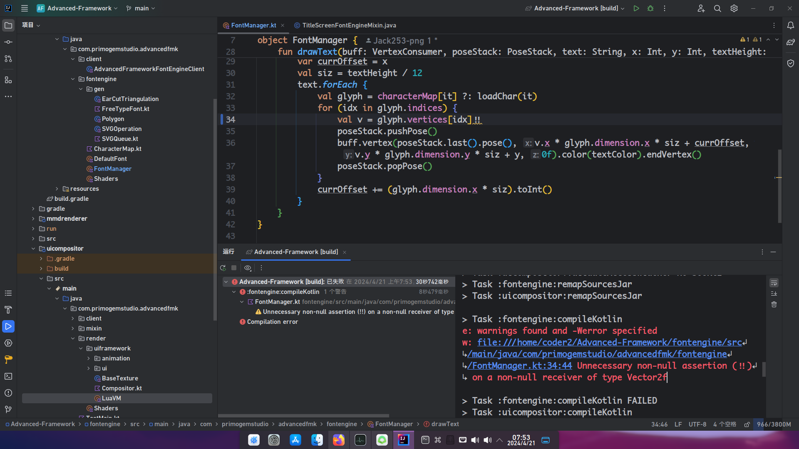

# Werror mode
Like Linux kernel，We have enabled Werror in every submodule of Advanced Framework 
Any compile-time warnings in the code are marked as errors 

Such as unnecessary null assertion in Kotlin

